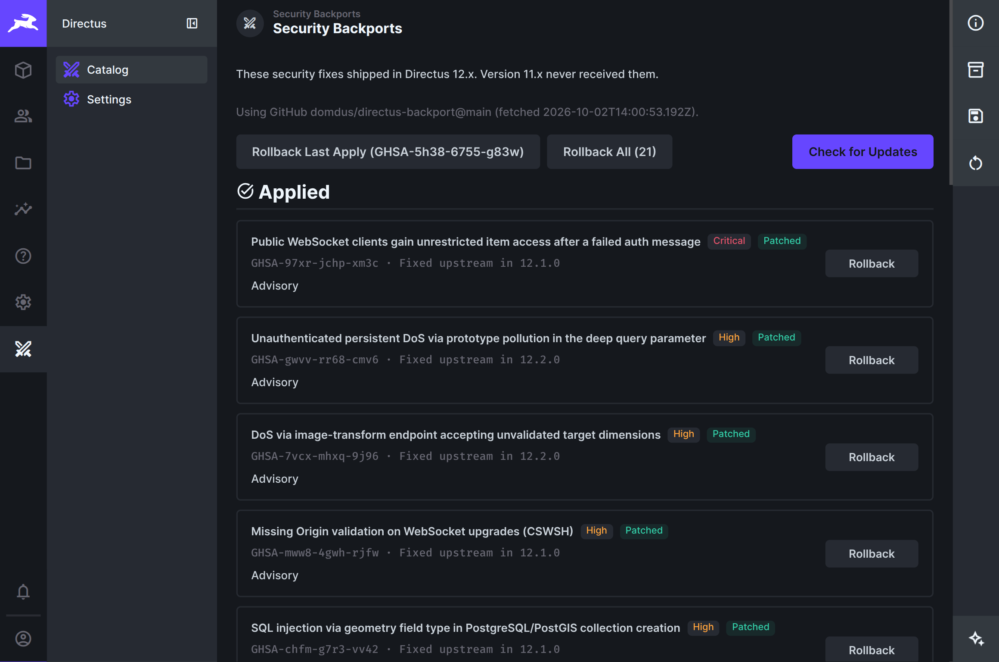

# Security Backports (Directus extension)

Security fixes for Directus ship on the current major. Older installs (9 / 10 /
11) do not get those patches from upstream.

This Studio module is a stopgap for that gap: it applies known security overlays
into your running install’s `node_modules`, with snapshots so you can undo them.
Nothing is applied until you choose a fix and click Apply.

It only works on the exact builds we tested — **Directus 10.13.4** and
**11.17.4**. Each overlay is checksum-pinned to that compiled tree, so a nearby
version (another 10.13.x, 11.16.x, …) will not load or apply these patches.
Directus **9.26.0** is supported via CLI only (this Vue module will not load);
use the [repo CLI](../README.md) or `dist/cli.mjs` from a host that can reach
that install.

### How it works

Applied GHSAs are stored in `desired.json` next to this extension. After
`node_modules` is reset, a boot hook re-applies them and exits once so the
process can reload. Rollback clears that list. `DIRECTUS_BACKPORT_AUTO=0`
disables the hook.

Apply and rollback exit the Node process. A process supervisor (or you) starts
Directus again.

## Usage

**Check for Updates** fetches the catalog. Apply ready GHSAs from the list:


Applied items show as **Patched** and can be rolled back:



**Rollback Last Apply** undoes the most recently applied remaining GHSA.
**Rollback All** undoes every applied backport. Settings can remove working
files (`desired.json`, snapshots).

If Directus does not start, Studio cannot help. From the host:

```bash
node …/extensions/directus-extension-backport/dist/cli.mjs rollback
node …/extensions/directus-extension-backport/dist/cli.mjs rollback --id GHSA-97xr-jchp-xm3c
node …/extensions/directus-extension-backport/dist/cli.mjs rollback --all
node …/extensions/directus-extension-backport/dist/cli.mjs apply --all --yes
node …/extensions/directus-extension-backport/dist/cli.mjs status

# Docker example
docker compose run --no-deps --entrypoint node directus \
  /directus/extensions/directus-extension-backport/dist/cli.mjs rollback
```

`dist/rollback.mjs` is the same emergency rollback without subcommands.

## Install

Requires Directus **10.13.4** or **11.17.4** (`directus:extension.host`).

```bash
# from repo root
npm install && npm run build
cd directus-extension-backport && npm install && npm run build
```

Install like any Directus extension: put `package.json` and `dist/` in
`…/extensions/directus-extension-backport/`, then enable **Security Backports**
under **Settings → Project Settings → Modules**. Open the module and use
**Check for Updates** once.
