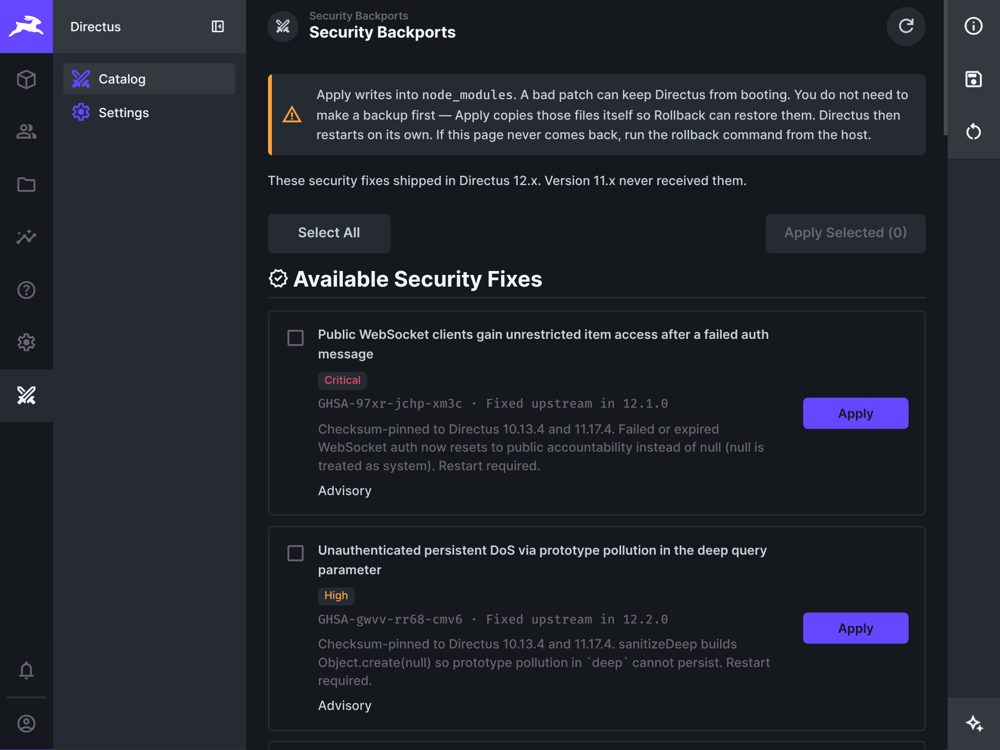

# Security Backports (Directus extension)

Studio UI for [directus-backport](../README.md) on **Directus 10.13.4** and
**11.17.4**. The catalog patches are checksum-pinned to those builds’
compiled `node_modules`. Other versions will not load this extension, and the
patches will not apply there.

Directus **9.26.0** is CLI-only: this Vue 3 module will not load on that host.
Use `cli.mjs` from the repo or copy it into the container.

The patch **engine** and **`cli.mjs`** ship inside this extension (required for
Marketplace — without the CLI you cannot emergency-rollback when Studio is down).
The extension does **not** ship `catalog/` by default. Admins opt in with
**Check for Updates**, which fetches overlays from GitHub into `catalog-remote/`
(`domdus/directus-backport@main`). That does not apply anything. For air-gapped
hosts, build with `INCLUDE_CATALOG=1 npm run zip:extension` (or
`npm run prebuild:with-catalog`).

Admins then apply ready patches to **this host's** `node_modules` and roll them
back. Studio uses the same engine as the CLI.

Applied GHSAs are stored in `desired.json` next to this extension. After
`node_modules` is reset, a boot hook re-applies them and exits once so the
process can reload. Rollback clears that list. `DIRECTUS_BACKPORT_AUTO=0`
disables the hook.

Apply and rollback exit the Node process. They do not restart Docker (or
anything else). A process supervisor has to start Directus again.

## Install

Requires Directus **10.13.4** or **11.17.4** (`directus:extension.host`).

Build from the repo:

```bash
cd ../   # repo root
npm install && npm run build
cd directus-extension-backport
npm install && npm run build
```

**Marketplace / zip:** `package.json`, `dist/`, **`cli.mjs`**, `rollback.mjs`
(no `catalog/`). After install, use **Check for Updates** once.

Build an install zip from the repo root (includes `cli.mjs`):

```bash
npm run zip:extension
# → directus-extension-backport/directus-extension-backport.zip (local only; not on GitHub)

INCLUDE_CATALOG=1 npm run zip:extension   # optional offline catalog
```

Unpack **all** of it into `/directus/extensions/directus-extension-backport/`
(or `/opt/node/directus/extensions/…`) — `package.json`, `dist/`, **`cli.mjs`**,
`rollback.mjs`. Then enable the module under **Settings → Project Settings → Modules**.

## Usage



In Studio: **Check for Updates** (header or Settings) to fetch the catalog, then
**Security Backports → Catalog** to apply ready GHSAs. **Rollback Last Apply**
undoes the most recently applied remaining GHSA. **Rollback All** undoes every
applied backport. Settings can also remove working files (`desired.json`,
snapshots).

If Directus does not start, Studio cannot help. From the host:

```bash
# Any install (Directus does not need to be up)
node /directus/extensions/directus-extension-backport/cli.mjs rollback
node /directus/extensions/directus-extension-backport/cli.mjs rollback --id GHSA-97xr-jchp-xm3c
node /directus/extensions/directus-extension-backport/cli.mjs rollback --all
node /directus/extensions/directus-extension-backport/cli.mjs apply --all --yes
node /directus/extensions/directus-extension-backport/cli.mjs status

# Docker
docker compose run --no-deps --entrypoint node directus \
  /directus/extensions/directus-extension-backport/cli.mjs rollback
```

`rollback.mjs` is the same emergency rollback without subcommands.
